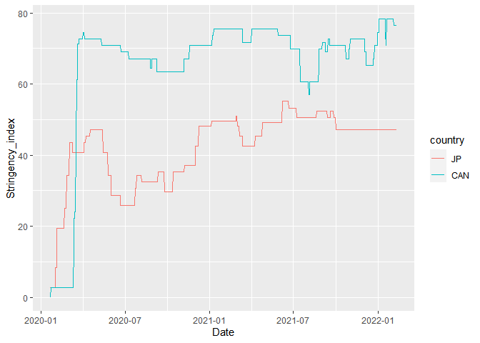

Final Project
================
Sandeep Nair
2/25/2022

## Abstract

\<Short summary of the report. Go over each section briefly>

## Introduction

COVID 19 in an ongoing pandemic which was first identified in December
2019. In its early stages, epidemiology experts emphasized the
importance of collecting data on policy decisions. As a result, large,
robust data sets are made available on the World heath Organisations
Website.

My group has identified two potential questions of interest for this
report:

-   We want to find out if two countries with similar populations and
    land area have a similar or different average new Covid cases rate
    through the timeline and similar or different average death rates.
    We chose United Kingdom and France for this comparison.

-   To check if there is a correlation between the infected rate and
    Response policy. Stringency index ,which is calculated by the Oxford
    COVID-19 Response team, is used to numerical represent response
    policy.

-   Additionally, we would identify two countries with contrasting
    policy response (stringent vs relaxed) to check if policy response
    had a significant effect on disease control.

## Background

The data obtained from WHO includes the date reported, country code,
country, WHO region, new Covid cases per date, cumulative Covid cases,
new death rates, and cumulative deaths from dates 03-Jan-2020 to
17-Feb-2022. Although our data has been presented to us through the
World Health Organiztion, these numbers are subject to bias based on the
number of testing a country does and if the country is truly giving
correct numbers to the WHO.

The stringency data set was obtained from
<https://ourworldindata.org/coronavirus>. The stringency index is
calculated based on nine response indicators including school closures,
workplace closures, and travel bans, rescaled to a value from 0 to 100
(100 = strictest). This index is calculated by Oxford COVID-19
Government Response Tracker (oxCGRT).

The two dataset use different country codes. To join the two datasets,
we need to convert the three letter country code in the stringency
dataset to two letters. We need a database which matches two letter
codes to three letter codes. This was obtained as a .csv file from
<https://gist.github.com/tadast/8827699#file-countries_codes_and_coordinates-csv-L1>.

Code for data wrangling and joining:

``` r
library(tidyverse)
library(reshape2)
```

``` r
Covid <- read_csv("./data/WHO-COVID-19-global-data.csv")
head(Covid)
```

    ## # A tibble: 6 x 8
    ##   Date_reported Country_code Country     WHO_region New_cases Cumulative_cases
    ##   <date>        <chr>        <chr>       <chr>          <dbl>            <dbl>
    ## 1 2020-01-03    AF           Afghanistan EMRO               0                0
    ## 2 2020-01-04    AF           Afghanistan EMRO               0                0
    ## 3 2020-01-05    AF           Afghanistan EMRO               0                0
    ## 4 2020-01-06    AF           Afghanistan EMRO               0                0
    ## 5 2020-01-07    AF           Afghanistan EMRO               0                0
    ## 6 2020-01-08    AF           Afghanistan EMRO               0                0
    ## # ... with 2 more variables: New_deaths <dbl>, Cumulative_deaths <dbl>

``` r
stringency = read_csv("./data/covid-stringency-index.csv")
head(stringency)
```

    ## # A tibble: 6 x 4
    ##   Entity      Code  Day        stringency_index
    ##   <chr>       <chr> <date>                <dbl>
    ## 1 Afghanistan AFG   2020-01-21                0
    ## 2 Afghanistan AFG   2020-01-22                0
    ## 3 Afghanistan AFG   2020-01-23                0
    ## 4 Afghanistan AFG   2020-01-24                0
    ## 5 Afghanistan AFG   2020-01-25                0
    ## 6 Afghanistan AFG   2020-01-26                0

``` r
country = read_csv("./data/countries_codes_and_coordinates.csv")
```

    ## Rows: 256 Columns: 6

    ## -- Column specification --------------------------------------------------------
    ## Delimiter: ","
    ## chr (3): Country, Alpha-2 code, Alpha-3 code
    ## dbl (3): Numeric code, Latitude (average), Longitude (average)

    ## 
    ## i Use `spec()` to retrieve the full column specification for this data.
    ## i Specify the column types or set `show_col_types = FALSE` to quiet this message.

``` r
colnames(country)[3] = "Code"
```

``` r
stringency_2letter = left_join(stringency, country, by="Code")
stringency_2letter = stringency_2letter[,c(3,6,4)]
colnames(stringency_2letter)[2] = "Code_2"
```

``` r
joined = inner_join(Covid, stringency_2letter, by = c("Date_reported" = "Day","Country_code" = "Code_2" ))
head(joined)
```

    ## # A tibble: 6 x 9
    ##   Date_reported Country_code Country     WHO_region New_cases Cumulative_cases
    ##   <date>        <chr>        <chr>       <chr>          <dbl>            <dbl>
    ## 1 2020-01-21    AF           Afghanistan EMRO               0                0
    ## 2 2020-01-22    AF           Afghanistan EMRO               0                0
    ## 3 2020-01-23    AF           Afghanistan EMRO               0                0
    ## 4 2020-01-24    AF           Afghanistan EMRO               0                0
    ## 5 2020-01-25    AF           Afghanistan EMRO               0                0
    ## 6 2020-01-26    AF           Afghanistan EMRO               0                0
    ## # ... with 3 more variables: New_deaths <dbl>, Cumulative_deaths <dbl>,
    ## #   stringency_index <dbl>

## Descriptive Analysis (by 2/25)

Tasks

1.  Identify countries with severe restrictions and relaxed policies for
    case study

``` r
japan= joined %>% filter(Country_code =="JP" )
mean((japan$stringency_index))
```

    ## [1] 42.13217

``` r
Canada = joined %>% filter(Country_code == "CA")
mean(Canada$stringency_index)
```

    ## [1] 65.58653

``` r
t.test(japan$stringency_index, Canada$stringency_index)
```

    ## 
    ##  Welch Two Sample t-test
    ## 
    ## data:  japan$stringency_index and Canada$stringency_index
    ## t = -31.471, df = 1179.2, p-value < 2.2e-16
    ## alternative hypothesis: true difference in means is not equal to 0
    ## 95 percent confidence interval:
    ##  -24.91658 -21.99215
    ## sample estimates:
    ## mean of x mean of y 
    ##  42.13217  65.58653

From the t-Test we can see that there is a statistically significant
difference between the stringency indices of Canada and Japan. We can
say with 95 confidence that Canada’s stringency measure was 24.916 to
21.99 units higher than Japan’s.

2.  Plot of stringency index overtime in selected countries

``` r
string_combined = inner_join(japan, Canada, by= "Date_reported")
string_combined = string_combined[,c(1,9,17)]
colnames(string_combined) = c("Date","JP","CAN")
string_melt = melt(string_combined, id.vars = "Date", variable.name = "country")
colnames(string_melt)[3]= "Stringency_index"
ggplot(data = string_melt, aes(Date, Stringency_index))+geom_line(aes(colour = country))
```

<!-- -->

3.  Box plot comparing infection levels.

## Inferential Analysis(by 2/27)

Tasks

1.  Select either Anova or linear regression to model data

2.  Explain selected model, parameters, assumptions

3.  Hypothesis testing and conclusion

## Sensitivity Analysis (by 2/28)

Task - Examine the residual plot of the fitted model. we need to explain
your findings in these plot

## Discussion

Tasks -

1.  A brief recap of this project.

2.  Findings in the inferential analysis interpreted in the context of
    WHO findings

3.  Suggestions for future research and/or policy making given your
    findings.

4.  Caveats of the current analysis

## Acknowledgement

Discussed project with my group member, Oh Seung Kwon

## Reference

1.  <https://ourworldindata.org/coronavirus>.

2.  <https://gist.github.com/tadast/8827699#file-countries_codes_and_coordinates-csv-L1>.

<update as we go>
